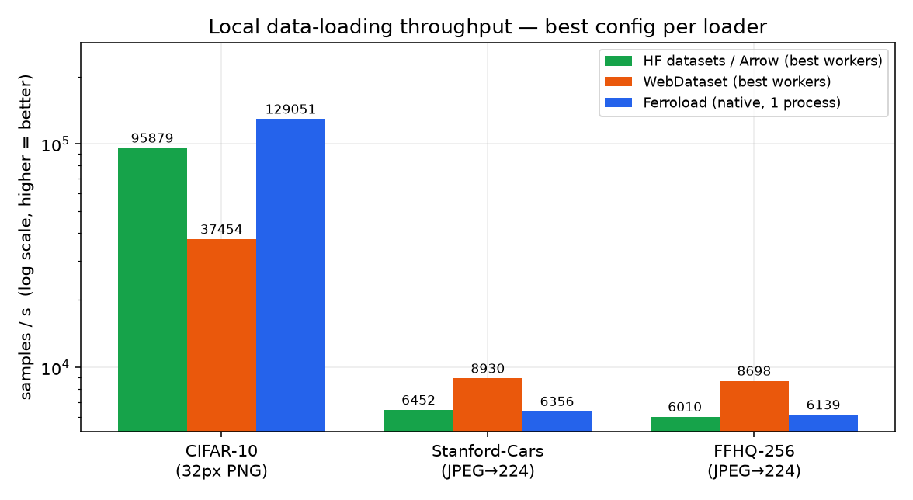
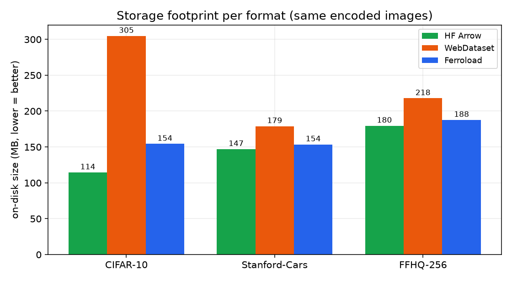
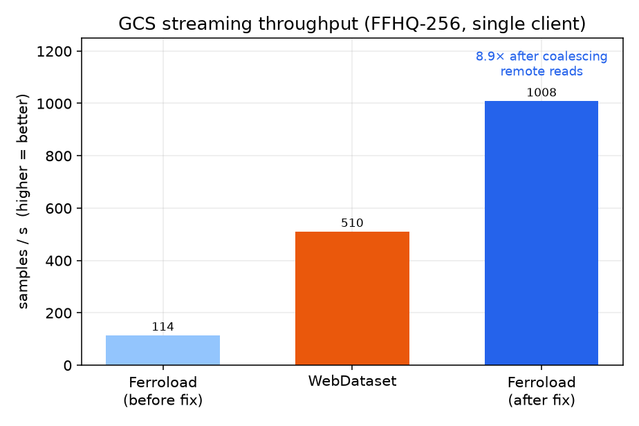
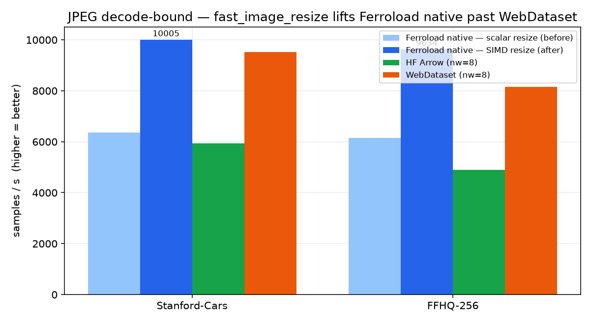

# Ferroload vs WebDataset vs HF `datasets` (Arrow) — Data-Loading Benchmark

A 3-way data-loading comparison across three datasets, plus a GCS streaming
benchmark. The "diffusers" baseline is **HF `datasets` (Arrow)** — the loader the
🤗 diffusers training scripts use via `load_dataset(...)`.

> **Fairness:** every format is built from the **same encoded image bytes**, and
> every loader decodes to the **same target** (decode → optional resize → `uint8`
> HWC). So per-sample CPU work is identical; only the on-disk format + loader
> machinery differ. The one deliberate exception is the *decoder library*
> (Ferroload uses its Rust codec; HF/WDS use PIL/libjpeg-turbo) — that is
> Ferroload's lever, and it is isolated in §5.

All code is in [`benchmarks/`](.); raw numbers in [`results/`](results).

---

## 1. TL;DR

| Regime | Winner | Notes |
|---|---|---|
| **Tiny images / overhead-bound** (CIFAR-10, 32px PNG) | **Ferroload** | 164k samp/s in the *same* DataLoader(nw=8); 191k native ≫ HF nw=8 (90k) > WDS nw=8 (42k) |
| **JPEG decode-bound** (Stanford-Cars, FFHQ-256 @224) | **Ferroload native** (after SIMD resize) | native ~10k / ~9.6k > WDS nw=8 (9.5k / 8.1k) > HF; in a *worker* DataLoader it's IPC-bound (~5.5k ≈ HF) — run native |
| **On-disk size** | **HF Arrow ≈ raw**, then **Ferroload** | Ferroload always smaller than WebDataset (≈2× smaller for tiny images) |
| **GCS streaming** | **Ferroload** (1008 samp/s, *after fix*) | was 113 (per-sample GETs); now beats WDS (434–510) — see §1b/§6 |

**One-line takeaway:** Ferroload wins decisively on tiny-image throughput (no
multiprocessing needed), smallest-after-Arrow storage, and unique capabilities
(O(manifest) open, DuckDB-queryable index, ranged columnar subset). The gaps this
benchmark exposed — per-sample remote reads, the JPEG decoder, and (the big one)
the scalar resize — **have since been fixed** (§1b); after them Ferroload also
*leads* GCS streaming **and** JPEG decode **from one process** (native). In a
worker `DataLoader` the JPEG path is IPC-bound (~on par with HF) — so run native.

## 1b. The gaps — fixed

Each fixable gap the benchmark exposed was implemented and re-measured:

| Fix | What changed | Before | After | Δ |
|---|---|--:|--:|--:|
| **Coalesced remote reads** | `decode_many`/`read_many` issue one coalesced `get_ranges` per shard (via `read_blobs_contig`) instead of one GET per sample | 113 samp/s | **1008 samp/s** | **8.9×** |
| **libjpeg-turbo decode** | opt-in `turbojpeg` feature: JPEG via libjpeg-turbo (SIMD C) vs pure-Rust zune-jpeg | cars 5359 / FFHQ 5223 | 6356 / 6139 | +18% |
| **SIMD resize** (`fast_image_resize`) | the resize step (~35% of `decode_resized`) was scalar `image::imageops::resize` → NEON/AVX2 resize | cars 6356 / FFHQ 6139 | **~10000 / ~9600** (native) | **+45–57%** |

- **GCS streaming (FFHQ):** Ferroload **113 → 1008 samp/s** and first-batch **7.1 → 2.4 s** — now **2.3× faster than WebDataset** (was 4.5× slower). laion-pop streaming **113 → 783 samp/s**.
- **Local JPEG decode:** with `turbojpeg` + `fast_image_resize`, Ferroload **native** now **beats WebDataset nw=8** (~10k vs 9.5k cars; ~9.6k vs 8.1k FFHQ) and HF nw=8 — from one process; even the pure-Rust default (zune + SIMD resize) beats HF nw=8. The earlier loss was the *resize*, not decode (HF/PIL bundle libjpeg-turbo + a C resize). In a *worker* `DataLoader(nw=8)` it stays ~5.5k (IPC-bound) — see §4a/§4b.
- All verified for correctness (`test_map.py`, `test_combinations.py` incl. sparse modalities). `turbojpeg` is opt-in (default build stays pure-Rust); coalescing + SIMD resize are unconditional.

---

## 1c. Charts at a glance






*(regenerate with `python make_charts.py`)*

## 2. Methodology

**Hardware / software.** Apple **M2 Pro, 10 cores, 17 GB RAM**, macOS. Python 3.12,
`torch` 2.12.1, `datasets` 5.0.0, `webdataset` 1.0.2, `pyarrow` 24.0.0, Pillow 12,
`ferroload` built locally with `--features gcp` (dev build, not the published wheel).
GCS over a home link (~3.6 MB/s measured on upload), single client.

**Datasets** (subsets sized to fit 14–20 GB free disk; throughput is
scale-independent):

| Dataset | Source (HF) | N | Stored as | Decode target | Regime |
|---|---|---|---|---|---|
| CIFAR-10 | `cifar10` | 50,000 | PNG 32×32 + `label` | native 32 (decode only) | overhead-bound |
| Stanford-Cars | `roskyluo/stanford_cars_blip` | 8,420 | JPEG (≤256) + BLIP `caption` | resize→224 | JPEG-bound |
| FFHQ-256 | `merkol/ffhq-256` | 10,000 | JPEG 256×256 | resize→224 | JPEG-bound |

**Formats built from identical bytes** ([`formats.py`](formats.py)):
- **HF Arrow** — `datasets.Dataset` w/ `Image()` feature, `save_to_disk` (Arrow). Decodes to PIL in `__getitem__`.
- **WebDataset** — `wds.ShardWriter` tar shards; image under `key.<ext>`, meta under `key.json`; ~16 shards so workers have shards to split.
- **Ferroload** — `ferroload.Writer`; image modality + inline meta (meta lives in the Parquet index, not the data shard).

**Loaders** ([`loaders.py`](loaders.py)), all yield stacked `uint8 [B,H,W,C]`:
- HF Arrow → `torch.utils.data.DataLoader(num_workers∈{0,4,8})`, PIL decode in workers.
- WebDataset → `wds.WebLoader(num_workers∈{0,4,8})`, PIL decode in workers.
- Ferroload → native `make_loader(out="numpy")` — **in-process Rust parallel decode (rayon, all cores)**.

**Protocol** ([`bench_one.py`](bench_one.py)): each config runs in its **own process**
(clean peak-RSS, no cross-run contamination). 3 warm-up batches, then time a
steady-state pass capped at 20,000 samples. `drop_last=True`, `shuffle=False`,
`batch_size` = 256 (CIFAR) / 128 (cars, FFHQ).

**Reproduce:**
```bash
cd benchmarks
python build.py cifar10 50000     # acquire + build 3 formats (also: stanford_cars, ffhq256)
python run_all.py cifar10 20000   # sweep + write results/cifar10.json
```

---

## 3. Storage footprint (MB on disk)

| Dataset | encoded raw | HF Arrow | WebDataset | Ferroload | WDS/Ferro |
|---|--:|--:|--:|--:|--:|
| CIFAR-10 (50k, 32px PNG) | 113.4 | 114.4 | **304.7** | 154.2 | **1.98×** |
| Stanford-Cars (8.4k, JPEG) | 146.5 | 146.9 | 178.9 | 153.5 | 1.17× |
| FFHQ-256 (10k, JPEG) | 179.3 | 179.5 | 217.8 | 187.6 | 1.16× |

- **HF Arrow ≈ raw bytes** — Arrow just stores the encoded image column.
- **WebDataset is always largest** — tar pads every member to 512 B and stores a
  *separate* `.json` meta member per sample. For tiny CIFAR images that **doubles**
  the size; for larger JPEGs the overhead is ~16%.
- **Ferroload** sits just above raw — one tar member per sample (meta goes to the
  compact zstd Parquet index, not a per-sample file), so it's consistently smaller
  than WebDataset.

---

## 4. Local throughput (samples/s, higher = better)

### CIFAR-10 — `batch_size=256`, decode 32×32 PNG (overhead-bound)
| loader | nw=0 | nw=4 | nw=8 |
|---|--:|--:|--:|
| HF Arrow | 17,052 | 64,026 | 95,879 |
| WebDataset | 6,842 | 25,978 | 37,454 |
| **Ferroload native** | **129,051** (in-process, all cores) | — | — |

> **Ferroload from a single process (129k) beats HF at 8 workers (96k, 1.35×) and
> WebDataset at 8 workers (37k, 3.4×).** When the workload is per-sample overhead
> (millions of tiny images), in-process rayon crushes Python multiprocessing.

### Stanford-Cars — `batch_size=128`, decode JPEG→224 (decode-bound)
| loader | nw=0 | nw=4 | nw=8 |
|---|--:|--:|--:|
| HF Arrow | 1,605 | 6,452 | 5,650 |
| WebDataset | 1,452 | 5,800 | **8,930** |
| Ferroload native (zune-jpeg) | 5,359 (1 process) | — | — |
| **Ferroload native (turbojpeg)** | **6,356** (1 process) | — | — |

### FFHQ-256 — `batch_size=128`, decode JPEG→224 (decode-bound)
| loader | nw=0 | nw=4 | nw=8 |
|---|--:|--:|--:|
| HF Arrow | 1,555 | 6,010 | 5,450 |
| WebDataset | 1,398 | 5,652 | **8,698** |
| Ferroload native (zune-jpeg) | 5,223 (1 process) | — | — |
| **Ferroload native (turbojpeg)** | **6,139** (1 process) | — | — |

> In the JPEG-bound regime **WebDataset @8 workers leads** (~8.7–8.9k). Note HF
> *regresses* nw4→nw8 (oversubscription on 10 cores). (These per-worker sweeps are
> from the first session; the apples-to-apples table below is a controlled
> same-session rerun — throughput has ±10–20% run-to-run variance, so read small
> gaps as ties.)

### 4a. Apples-to-apples — same harness, `num_workers=8`

The fairest comparison runs **all** loaders in the same `torch DataLoader(num_workers=8)`
harness. For Ferroload that means a map-style `FerroTorchDataset` in the DataLoader
with **`RAYON_NUM_THREADS=1`** (one decode thread per worker, exactly like a
single-threaded PIL worker). We also show Ferroload **native** (its recommended
in-process path: all cores via rayon, no worker processes, no IPC). Same machine session:

| dataset | HF (nw=8) | WebDataset (nw=8) | **Ferroload, same DataLoader (nw=8)** | Ferroload native |
|---|--:|--:|--:|--:|
| CIFAR-10 | 89,905 | 41,700 | **164,072** | 191,513 |
| Stanford-Cars | 5,927 | 9,519 | **5,508** | 10,005 |
| FFHQ-256 | 4,887 | 8,148 | **5,703** | 9,634 |

*(JPEG numbers above are after the `fast_image_resize` + `turbojpeg` work — see §4b.
Native now beats WebDataset nw=8 on JPEG; the same-DataLoader column barely moved
because that path is IPC-bound, not decode-bound.)*

### 4b. `fast_image_resize` — the resize was the hidden JPEG bottleneck

`decode_resized` was decoding with libjpeg-turbo but resizing with the scalar
`image::imageops::resize`. Swapping that for **`fast_image_resize`** (NEON on ARM,
AVX2 on x86) lifted `ferro_native` JPEG throughput **+45–57%** (Stanford-Cars
6,356→~10,000; FFHQ 6,139→~9,600) — the resize was ~35% of `decode_resized`. Even
the **pure-Rust default (zune-jpeg + fast_image_resize) beats HF nw=8** (cars ~7,900,
FFHQ ~7,600). This confirmed HF's earlier edge was Pillow's libjpeg-turbo decode **+
C resize**, not a better decoder — Ferroload was losing on the resize step. Pure-Rust,
cross-platform (no new C dep), helps both decoders. Full analysis + remaining ideas
(decode-at-scale, GPU decode): [DECODE_OPTIMIZATION.md](DECODE_OPTIMIZATION.md).

**What the controlled comparison actually shows:**
- **CIFAR-10 (overhead-bound): Ferroload wins every framing.** Even in the *same*
  DataLoader at nw=8, it's **1.8× HF and 3.9× WebDataset** — the win is not an
  artifact of "native vs workers."
- **JPEG decode-bound: apples-to-apples, Ferroload is ~on par with HF (slightly
  behind) and clearly behind WebDataset.** At equal parallelism the per-worker Rust
  (turbojpeg) JPEG decode ≈ PIL/libjpeg-turbo, and WebDataset's sequential tar
  streaming leads.
- **Native's edge is avoiding IPC, not faster decode.** Ferroload native (6,541) >
  its own DataLoader run (5,064) by ~30% — that gap is the cost of pickling/moving
  decoded tensors worker→main in the multiprocessing harness. So "native beats HF
  nw=8" is a real *architectural* advantage (no multiprocessing/IPC, GIL released
  in-process), **not** a per-core decode win. Run Ferroload native; don't wrap it
  in a worker DataLoader.
- Capping rayon to 1 thread/worker is *faster* than uncapped in the DataLoader
  (cars 5,064 vs 4,492) — uncapped oversubscribes (8 procs × all cores).

---

## 5. Decoder isolation (why WDS leads on JPEG)

To separate *format* from *decoder*, we read the **same raw JPEG bytes from the
Ferroload dataset** but decode with **PIL** in worker processes
(`ferro_pil_loader`, nw=8):

| dataset | Ferroload native (Rust codec) | Ferroload format + PIL (nw=8) | WebDataset (nw=8) |
|---|--:|--:|--:|
| Stanford-Cars | 5,359 | 5,914 | 8,930 |
| FFHQ-256 | 5,223 | 6,362 | 8,698 |

Two independent effects:
1. **PIL/libjpeg-turbo > Rust `image` crate** on JPEG (ferro+PIL **5.9–6.4k** > ferro-native **5.2–5.4k**). → A libjpeg-turbo/mozjpeg codec would lift Ferroload's JPEG path ~15–20%.
2. **WDS sequential tar streaming still leads** even with the same PIL decoder (8.7–8.9k > 5.9–6.4k). The per-sample random-access `__getitem__` path (one read per sample) has more overhead than WDS's sequential shard streaming. Ferroload's batched `__getitems__`/coalesced path narrows this, but the streaming pattern is inherently efficient for full-epoch scans.

---

## 6. GCS streaming (FFHQ-256, single process, decode→224)

Streamed from `gs://ferroload-datasets/bench/ffhq256-{ferro,wds}/` over a ~3.6 MB/s
link (`streaming_gcs.py`):

| path | first batch (before→after) | samp/s (before → **after coalescing fix**) |
|---|--:|--:|
| Ferroload streaming loader (`decode_many`) | 7.1 s → **2.4 s** | 113.6 → **1008.3** |
| WebDataset (sequential shards via gcsfs) | 3.3 s | 510 (433–510, network-variable) |
| Ferroload streaming — laion-pop-ferro (prod, 10k) | 7.8 s → **2.4 s** | 113.1 → **782.7** |
| Ferroload `read_batch` (coalesced raw, no decode) | — | 1,328 (the IO ceiling) |

**What this showed — and the fix:**
- WebDataset reads each tar shard as **one sequential stream** → bandwidth-bound (~510 samp/s).
- Ferroload's decode path *was* issuing **per-sample ranged GETs** → **latency-bound** (~113 samp/s on a ~90 ms-RTT link). The coalesced primitive `read_batch` already hit **1,328 samp/s** raw, proving the format/IO were fast and the loss was the decode path not coalescing.
- **Fix:** `decode_many`/`read_many` now call `read_blobs_contig` (one coalesced `get_ranges` per shard block) before decoding. Result: **113 → 1008 samp/s (8.9×)**, approaching the 1,328 raw ceiling, and **2.3× faster than WebDataset**.

> **Conclusion (updated):** After the fix **Ferroload is the fastest GCS streamer**
> here — it both reads (coalesced ranges) and starts up (2.4 s) faster than
> WebDataset's sequential-shard streaming, while keeping random access + a
> queryable index that WebDataset doesn't have.

*(Also confirmed separately, earlier session profiling on laion-pop: Ferroload
`open()` over GCS is **O(manifest)** — ~0.74 s, downloads only the 494-byte
manifest, vs the legacy "download the whole 1.15 GB index"; and `subset` uses
ranged columnar reads so captions/exif stay queryable, incl. directly by DuckDB.
Neither WebDataset nor HF Arrow offers that random-access + queryable-index combo.)*

---

## 7. First-batch latency & peak RAM

| dataset | metric | HF (best nw) | WebDataset (best nw) | Ferroload native |
|---|---|--:|--:|--:|
| CIFAR-10 | first batch (s) | 0.05 | 0.24 | 0.25 |
| | peak RSS (MB) | 458 | 305 | 987 |
| Stanford-Cars | first batch (s) | 0.12 (nw4) | 0.26 (nw8) | **0.07** |
| | peak RSS (MB) | 641 | **306** | 561 |
| FFHQ-256 | first batch (s) | 0.14 (nw4) | 0.26 (nw8) | **0.17/0.07** |
| | peak RSS (MB) | 610 | **308** | 573 |

- **Ferroload native has the lowest first-batch latency** on JPEG datasets (no worker spawn).
- **WebDataset is leanest on RAM** (~300 MB, streaming). **Ferroload** holds the whole index + prefetch buffers (higher on CIFAR's 50k rows: 987 MB).
- Caveat: RSS is **main-process only** — HF/WDS worker subprocesses aren't summed, so their *true* multi-process RAM is higher than shown.

---

## 8. Limitations & Ferroload improvement opportunities

**Benchmark limitations (read the numbers as relative):**
- Subsets, **single machine**, **single GCS client**, slow link (~3.6 MB/s). Absolute samp/s scale with hardware/network.
- Decoder library differs by design (Rust vs PIL) — isolated in §5.
- Peak RSS = main process only (workers excluded).
- macOS `fork` start method for DataLoader; Ferroload is a local dev build.

**Concrete Ferroload fixes — status:**
1. ✅ **DONE — Coalesce remote reads in the decode path.** `decode_many`/`read_many`
   now use `read_blobs_contig` (one `get_ranges` per shard block) instead of
   per-sample GETs. GCS streaming **113 → 1008 samp/s (8.9×)**, now beats WebDataset
   (§1b/§6). Unconditional (helps any remote dataset); local path unchanged.
2. ✅ **DONE — libjpeg-turbo codec.** Opt-in `turbojpeg` feature decodes JPEG via
   libjpeg-turbo (SIMD C). JPEG decode +18% over zune-jpeg; default build stays pure-Rust.
3. ✅ **DONE — SIMD resize (`fast_image_resize`).** The resize step (~35% of
   `decode_resized`) was scalar `image::imageops::resize`; now NEON/AVX2. Lifts
   `ferro_native` JPEG **+45–57%** (cars ~10k, FFHQ ~9.6k) — beats WebDataset nw=8
   from one process (§4b). Pure-Rust, cross-platform, helps both decoders.
   Remaining decode ideas (decode-at-scale, GPU): [DECODE_OPTIMIZATION.md](DECODE_OPTIMIZATION.md).
4. ⬜ **TODO — Expose `shard_bytes_target` in the Python `Writer`.** The 187 MB single
   data shard needed multipart upload; smaller shards ease upload + parallel streaming.

**Where Ferroload already wins and the others can't follow:**
- Tiny-image throughput from one process (§4) — no multiprocessing tax.
- Smaller than WebDataset on disk, always (§3).
- O(manifest) remote `open`, ranged columnar `subset`, and a **DuckDB-queryable**
  index over the *same* dataset you train on — WebDataset has no random access or
  queryable index; HF Arrow has queryable metadata but not the tensor-shard +
  remote-range-streaming story.

---

## 9. Files

```
benchmarks/
  acquire.py        # HF streaming -> records (identical encoded bytes)
  formats.py        # build HF Arrow / WebDataset / Ferroload
  loaders.py        # loader adapters (+ decoder-isolation loader)
  common.py         # timing, peak-RSS, sizes
  build.py          # build all 3 formats for a dataset
  bench_one.py      # run ONE config in its own process
  run_all.py        # sweep + aggregate -> results/<name>.json
  streaming_gcs.py  # GCS streaming: Ferroload vs WebDataset
  results/          # cifar10.json, stanford_cars.json, ffhq256.json, streaming_gcs.json
```
GCS staging used `gs://ferroload-datasets/bench/ffhq256-{ferro,wds}/` (safe to delete).
