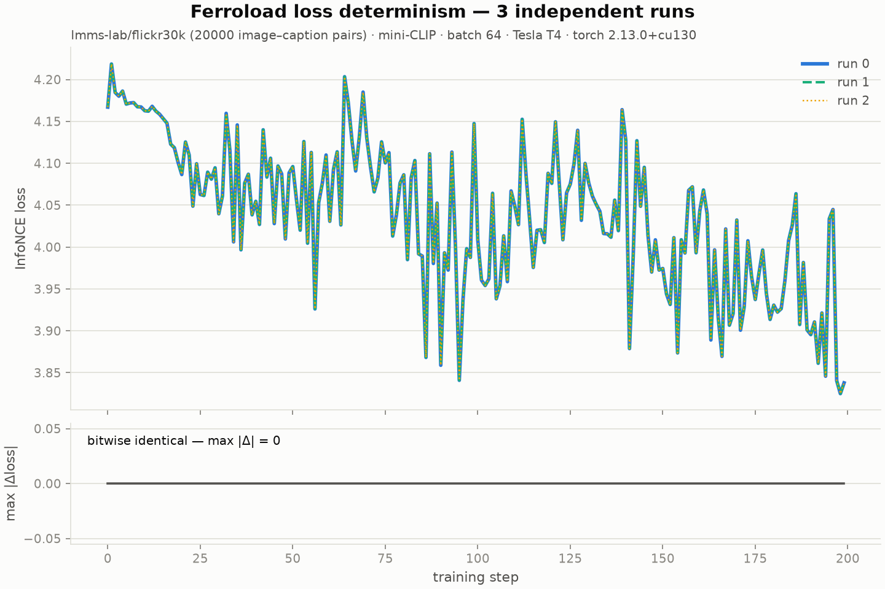

# Image+text training determinism

Trains a small CLIP-style contrastive model (image tower: 4-block CNN; text
tower: hashed bag-of-words MLP; symmetric InfoNCE) on **Flickr30k** — 31k
photos, each with 5 crowd-sourced captions — packed into the Ferroload format,
and shows that **independent training runs produce bitwise-identical loss
curves**.

Ferroload's contribution to that claim is the data path: `make_loader(seed=…)`
uses a deterministic sampler (`set_epoch` reshuffles it identically every run,
DDP-aware), and the parallel in-Rust decode returns batches in a fixed order.
The rest is standard torch hygiene, handled in `common.py`: seeded RNGs,
`torch.use_deterministic_algorithms(True)`, a crc32 (not salted-`hash`) text
featurizer, and a model built only from ops with deterministic CUDA kernels.



Top panel: per-step loss for every run, overlaid (different linewidths /
linestyles, so coincident curves stay visible). Bottom panel: the max absolute
loss difference across all run pairs at each step — a flat zero line.

## Run it on Modal (recommended)

The Modal harness is also the test: it fans the runs out to *separate*
containers on the same GPU model (T4), asserts the curves are bit-identical,
and exits non-zero if they diverge.

```bash
pip install modal && modal setup            # once
modal run samples/image_text_determinism/modal_app.py                    # 3 runs, 200 steps, 20k pairs
modal run samples/image_text_determinism/modal_app.py --runs 5 --steps 300 --limit 31000
modal run samples/image_text_determinism/modal_app.py --limit 2000 --steps 60   # quick smoke (~5 min)
```

The first invocation streams Flickr30k from HuggingFace and packs it once into
a Modal Volume (`ferroload-samples`); later runs reuse it. The plot and raw
loss curves land next to this README as `loss_determinism.png` / `.json`.

## Distributed (multi-GPU / multi-node)

The `ddp` entrypoint runs the same test under DDP, where each rank opens the
dataset with `make_loader(world_size=, rank=)` — Ferroload's deterministic
sampler hands every rank a disjoint, reproducible shard, and that sharding is
what's under test. Per step it records each rank's *local* loss and the
all-reduced *global* loss; the assertion covers both, across runs.

```bash
# single-node multi-GPU (default T4:2; e.g. FERROLOAD_SAMPLE_GPU_DDP=L4:4 to change)
modal run samples/image_text_determinism/modal_app.py::ddp --runs 3 --steps 60

# multi-node: gang-scheduled Modal cluster (opt-in; cluster size is fixed at
# import, so it's set by env var). Modal requires full nodes — A10G is 4/node,
# T4/L4/L40S/H100 are 8/node — and the total must fit your workspace GPU cap.
FERROLOAD_SAMPLE_NODES=2 FERROLOAD_SAMPLE_GPU_MULTINODE=A10G:4 \
  modal run samples/image_text_determinism/modal_app.py::ddp --nodes 2 --runs 2 --steps 40
```

Both configurations were verified on Modal (plot: `ddp_loss_determinism.png`):

- **1 node × 2×T4** (2 ranks): 3 runs × 60 steps in separate containers —
  global and per-rank curves bitwise identical.
- **2 nodes × 4×A10G** (8 ranks): 2 runs × 40 steps, each on its own
  gang-scheduled cluster (torchrun rendezvous over Modal's cluster network) —
  global and per-rank curves bitwise identical.

`NCCL_ALGO=Ring` is pinned in the image so NCCL's autotuner can't change the
reduction algorithm between runs; ring all-reduce order is fixed for a given
world size, which keeps the all-reduced loss (and DDP gradient averaging)
bitwise reproducible on identical hardware.

## Run it locally

Needs `ferroload torch datasets pillow matplotlib` installed:

```bash
python samples/image_text_determinism/train_local.py --limit 2000 --steps 60
```

## Files

- `common.py` — determinism setup, mini-CLIP model, training loop, plot
- `prepare_data.py` — stream an HF image+text dataset into the Ferroload format
  (auto-detects image/caption columns; also a standalone CLI)
- `modal_app.py` — Modal app: pack → N parallel GPU runs → assert + plot;
  `::ddp` entrypoint for the multi-GPU / multi-node variant
- `train_ddp.py` — torchrun-launched DDP worker (per-rank shard via
  `world_size`/`rank`, local + all-reduced loss curves)
- `train_local.py` — same demo on the local machine, no Modal

## Notes

- Bitwise reproducibility is defined *per hardware + library configuration*:
  identical GPU model, torch, CUDA, and ferroload versions. Curves from a T4
  will not match curves from an A100 bit-for-bit — but N runs on T4s do.
- Swap in any HF dataset with an image and a text column via
  `--hf-dataset/--split/--limit`; columns are auto-detected
  (`prepare_data.py --image-col/--caption-col` to override).
